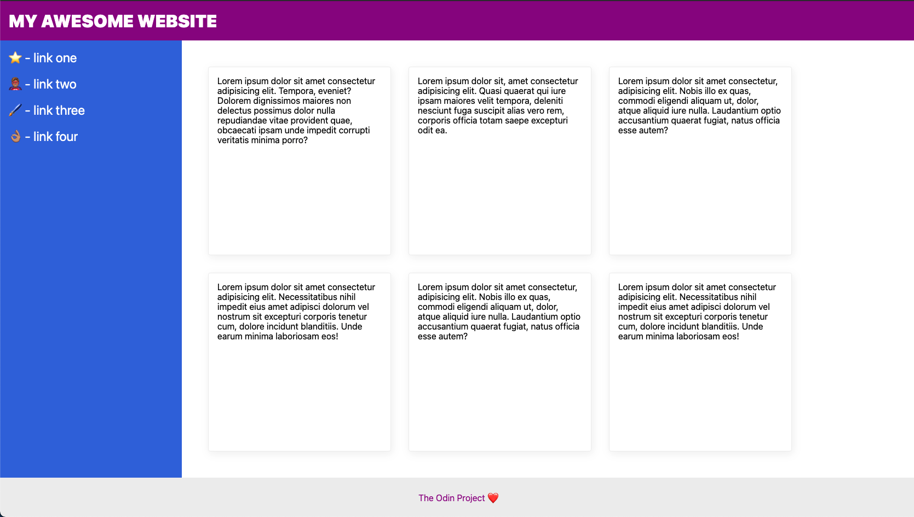

# The Holy Grail of Layout

In this flexbox exercise I recreated a common website layout. It is called the [Holy Grail](https://www.google.com/search?q=holy+grail+layout&tbm=isch&sclient=img) layout... and with flexbox it was actually pretty easy to pull off.

Some HTML was provided, but I changed a few things around to create the intended layout.

## Desired outcome

The number of cards lined up in that section will change based on the width of the screen.

On a smaller screen it will look like this:

### Self Check
- The header text is size 32px and weight 900.
- The header text is vertically centered and 16px from the edge of the screen.
- The footer is pushed to the bottom of the screen (the footer may go _below_ the bottom of the screen if the content of the 'cards' section overflows and/or if your screen is shorter).
- The footer text is centered horizontally and vertically.
- The sidebar and cards take up all available space above the footer.
- The sidebar is 300px wide (and it doesn't shrink).
- The sidebar links are size 24px, are white, and do not have the underline text decoration.
- The sidebar has 16px padding.
- There is 32px padding around the 'cards' section.
- The cards are arranged horizontally, but wrap to multiple lines when they run out of room on the page.
